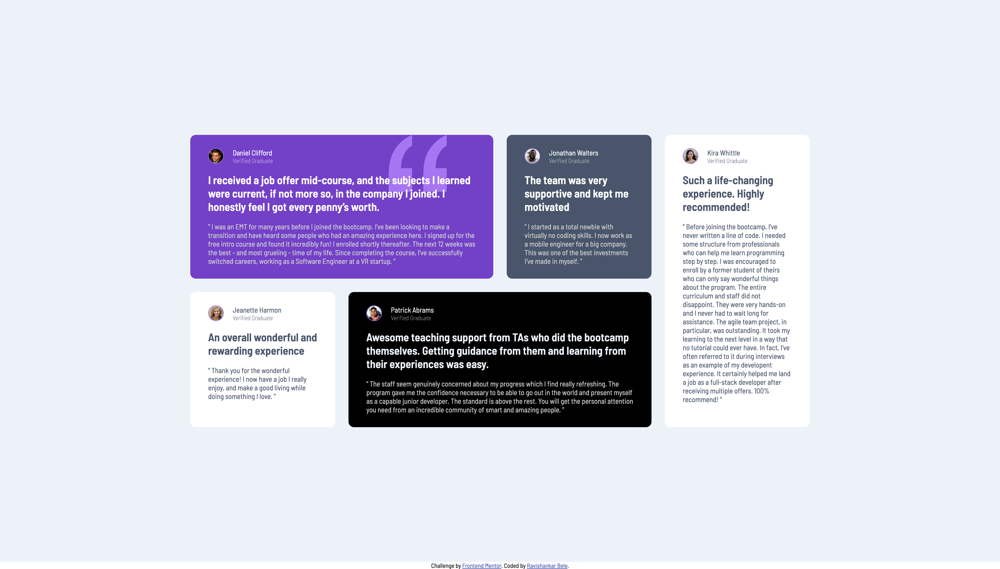

# Frontend Mentor - Testimonials grid section solution using CSS Grid layout

This is a solution to the [Testimonials grid section challenge on Frontend Mentor](https://www.frontendmentor.io/challenges/testimonials-grid-section-Nnw6J7Un7). Frontend Mentor challenges help you improve your coding skills by building realistic projects. 

## Table of contents

- [Overview](#overview)
  - [The challenge](#the-challenge)
  - [Screenshot](#screenshot)
  - [Links](#links)
- [My process](#my-process)
  - [Built with](#built-with)
  - [What I learned](#what-i-learned)
- [Author](#author)
- [Acknowledgments](#acknowledgments)

## Overview

### The challenge

Users should be able to:

- View the optimal layout for the site depending on their device's screen size

### Screenshot




### Links

- Solution URL: [GitHub](https://github.com/RaviBele/Frontend-Testimonial-Grid)
- Live Site URL: [Add live site URL here](https://your-live-site-url.com)

## My process

### Built with

- Semantic HTML5 markup
- CSS custom properties
- Flexbox
- CSS Grid

### What I learned

In this project, I learned about how to use grid template areas to create a layout. Also learned about how to change grid layout just by changing areas in grid-template-area.

```css
article {
    margin-inline: 1rem;
    margin-block: 1rem;
    max-width: 1110px;
    gap: 1.5rem;
    display: grid;
    grid-template-columns: 1fr 1fr 1fr 1fr;
    grid-template-areas: 
        "Purple Purple Grey Offwhite"
        "White Black Black Offwhite"
    ;
}

.daniel {
    background-color: #733FC8;
    grid-area: Purple;
}

.jonathan {
    background-color: #48556A;
    grid-area: Grey;
}

.jeanette {
    background-color: white;
    grid-area: White;
}

.patrick {
    background-color: black;
    grid-area: Black;
}

.patrick .title {
    color: #ECF2F8;
}

.kira {
    background-color: white;
    grid-area: Offwhite;
}

@media (max-width: 600px) {
    article {
        grid-template-columns: 1fr 1fr;
        grid-template-areas: 
        "Purple Purple"
        "Black Black"
        "Grey White"
        "Offwhite Offwhite"
        ;
    }
}

@media (max-width: 400px) {
    article {
        grid-template-columns: 1fr;
        grid-template-areas: 
        "Purple"
        "Grey"
        "White"
        "Black"
        "Offwhite"
        ;
    }
}
```

## Author

- Frontend Mentor - [@RaviBele](https://www.frontendmentor.io/profile/RaviBele)

## Acknowledgments

This is where you can give a hat tip to anyone who helped you out on this project. Perhaps you worked in a team or got some inspiration from someone else's solution. This is the perfect place to give them some credit.
